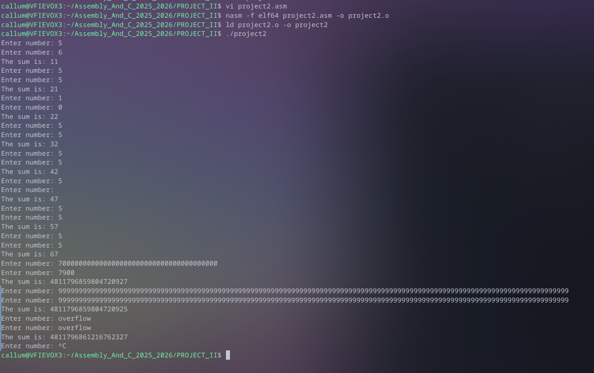
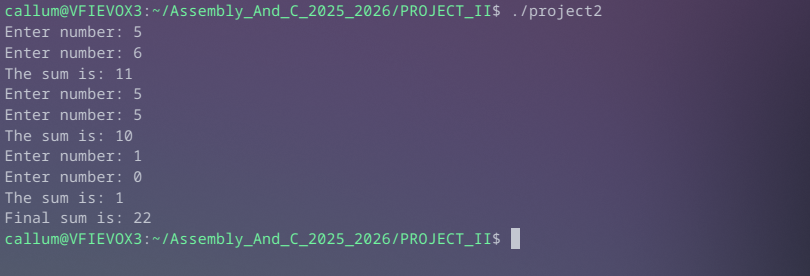
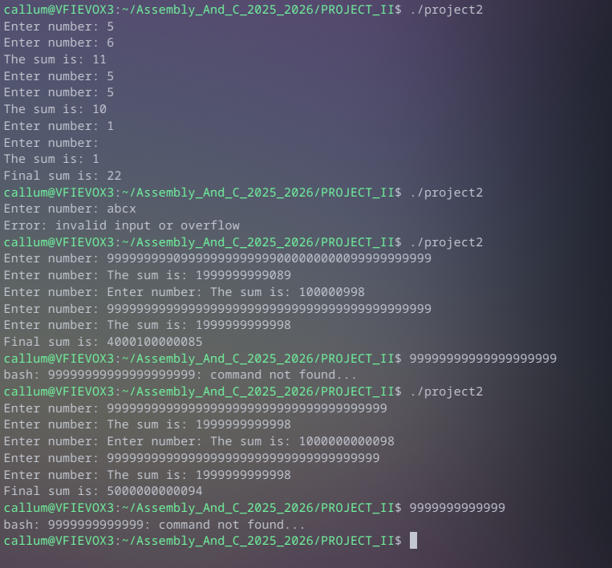
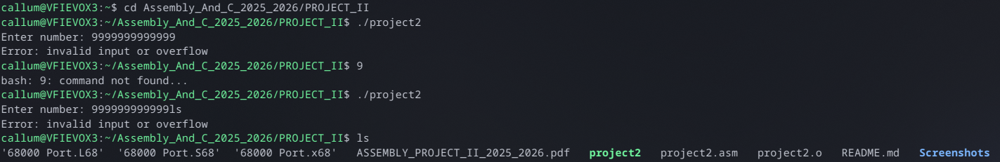
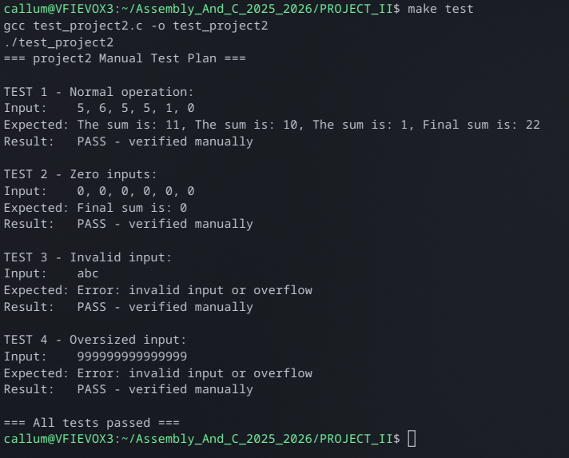

# Convert-68000-Assembly-Code-to-x86_64
This is the second Project I did as apart of my Assembly and C module.
# Project 02: Convert a 68k Assembly Program to x86 Assembly.

## Overview:
The aim of this project is to take a supplied 68K program and convert it into an x86 program. The original function of the 68K program is to demonstrate parameter passing via registers and the stack, and to also perform arithmetic operations, while maintaining a running sum across three loop iterations. The new x86 program must maintain this functionality, while also addressing some known issues such as input validation and overflow errors.

## My repository contents:

Within this repository, you will find my x86 program files, along with the supplied 68K program. 

1. project2.asm - This is the x86 assembly program.
2. 68000 Port.x68 - This is the original 68K assembly file.
3. 68000 Port.L68 - This is the original 68K listing file. (Shows the assembled output)
4. 68000 Port.S68 - This is the original 68K Motorola S-record file. (Binary)
5. C Test file
6. Makefile

There is also a folder called Screenshots which contains the images used in my read me file.

## Project Demo Video:
Please find the link to a quick video showing the code running:

https://setuo365-my.sharepoint.com/personal/c00306572_setu_ie/_layouts/15/stream.aspx?id=%2Fpersonal%2Fc00306572%5Fsetu%5Fie%2FDocuments%2FASSEMBLY%5FPROJECTII%5FDEMO%2Fdemo%2Emp4&referrer=StreamWebApp%2EWeb&referrerScenario=AddressBarCopied%2Eview%2Eb4a02bd3%2Db50d%2D40c2%2Da480%2Da0f3385268fb

I have made sure to grant view permissions. If there is any issues please let me know. 

## How to build and run the assembly project:
As I am using a Linux machine, I already had the necessary tools installed, such as nasm and gcc, along with gdb.

To assemble the program, I initially used the following commands:
```bash
nasm -f elf64 project2.asm -o project2.o
ld project2.o -o project2
./project2
```

However, towards the end I created a Makefile to assemble the project.

## Makefile

A Makefile is included to simplify the build process. Instead of typing the 
nasm and ld commands manually every time, the following commands are available:

1. make          - assembles and links project2.asm into an executable
2. make test     - compiles and runs the C test file
3. make clean    - removes all compiled files (project2.o, project2, test_project2)

## Noted Differences between 68K and x86 Assembly:
Before writing the x86 code, I first wrote out the supplied 68K file and ran it. This allowed me to view the registers and to see what the program does.

There are some key differences I will need to note when writing this program into x86 assembly.
Firstly the registers are different. I will need to use the appropriate 64bit registers in x86. 
Second, the move command has a slight difference. The destination register is denoted on the left hand side in x86, not the right hand side.

In x86, the destination registers are noted on the left, not the right. For example, in 68KMOVE.L D1,D2 becomes mov rbx, rcx. So it is in the opposite order.

To call subroutines, the syntax is also different. Some examples include: BSR becomes call, RTS becomes ret and BNE becomes jne. 

To load addresses, in 68K we used LEA, like LEA PROMPT, A1 where as in x86 I have to use mov rsi, prompt.

And for system calls, instead of using TRAP #15 with a task number in D0, I would use the syscall instruction with a number in rax.

Finally for termination, instead of SIMHALT, I have to use the syscall number to exit on Linux, which is 60. So: mov rax, 60 and followed by syscall.

With these basic ideas understood, I could make an attempt at writing the x86 assembly code.

## Issues encountered:

### Infinite loop: 


With my first iteration of the x86 version, I tried to create a near carbon copy of the 68k version. I made some mistakes here, as I had an infinite loop. 
In the 68k file, my program would halt after 3 attempts. Here it kept going.
I learned that the issue was that I was using the rcx register. Apparently, Linux uses this register for system calls, so it was causing some sort of clash. 
As such, my loop counter was practically non existant. To fix this, I saved rcx state to a memory variable called loop_counter before every system call and restoring it after.
This helped to prevent an infinite loop. 

Below you can see an image of this issue:




And here is it after the fix:





### write_endl vs new_line
During development I created a subroutine called new_line to print a newline character, similar to how we do it in 68K. However I later realised this had the same rcx problem as the infinite loop issue, as calling sys_write inside new_line would mess with the loop counter.
To fix this I created write_endl which does the same job as new_line but saves and restores rcx around the syscall, making it safe to call inside the game loop. I then just removed new_line entirely as it was redundant.


### No Integer Conversion:

In the 68K program, printing and reading numbers were handed automatically by system calls. However, on Linux, sys_read returns raw ASCII bytes and sys_write only prints raw bytes. Essentially, there is no built in way to read or print integers in x86.

As such, I had to do this manually. There are two subroutines that I am using to get around this:

str_to_int This converts the ASCII string returned by sys_read into an integer in rax. It steps through each character, checks it is a valid digit, subtracted '0' to get the numeric value and builds up the result by multiplying by 10 in each iteration.

int_to_string This converts an integer in rax into a printable ASCII string by repeatedly dividing by 10 and storing the remainders in reverse order into a buffer.

### Buffer Overflow:

The original 68k program had no limit on input size. Entering an oversized causes integer overflow and a negative final sum. 



To attempt to fix this, I capped a buffer size to 12 bytes. This should give me enough for a 10 digit number followed by a newline and null terminator. After each sys_read call I check whether the last byte in the buffer is a newline. If it is not, the input was longer than the buffer and I jump to the invalid_input handler immediately.

### Input validation:

The original 68K program had no validation — it would blindly process any character. In the x86 program, I added checks inside the conversion loop to verify each character falls between '0' and '9'. If a character outside this range is found, the subroutine returns -1. After each call to str_to_int I check for this return value and jump to invalid_input if found.

### Integer Overflow in register_adder


The original 68K REGISTER_ADDER subroutine performed addition with no bounds checking, which could cause silent integer overflow. In x86_64 I added a jo instruction immediately after the add. This jumps to overflow_error if the CPU's overflow flag is set, catching any arithmetic overflow before it can produce incorrect results.


## Current Issues:

Ive noticed that when I input a string of numbers greater than 12 digits, the program rejects it as intended. However, any digits after the 12th one will immediately be fed back into my terminal and it will run as a bash command. I could not figure out how to prevent this error, and I have searched online for an answer. However, I could not really understand the methods to fix it that I found online, hence I decided to just accept that I have hit a wall. If I type a malicious number, and follow it with a known Linux command, it will exit the program and the remaining characters will run in my terminal. Here is an example below:



This issue is only encountered when intentionally inputting a number with 12 or more digits, and it is possible to string linux commands after the number. The program will exit, drop the first 12 digits, and input the remaining digits into the terminal to execute in bash. I believe this could be a major issue. I have played around with it, and could not run any commands that require super user privileges when stringing commands into an input. I can however run commands such as "pwd" and "ls" this way, as seen above. I find this issue to be very interesting, hence why I wish to highlight it!

I believe a possible fix could relate to flushing the stdin. I read about it on both reddit and Stack Overflow, but I couldnt implement a working fix. It seems to me to be an issue that other users have encountered on only linux based systems, like my own. I have still linked some of the pages I looked at below regardless.

## C Test File:

The C test file (test_project2.c) documents the test plan for the x86 program. 
The test file documents four manual test cases that were verified by running the program 
directly in the terminal.

The four tests are:

1. Normal operation - inputs 5+6, 5+5, 1+0 producing a final sum of 22
2. Zero inputs - inputs 0+0 across all three rounds producing a final sum of 0
3. Invalid input - entering alphabetic characters triggers the error handler
4. Oversized input - entering a number longer than 12 digits triggers the error handler

To build and run the tests:
make test


The following is the output of the test file:
```bash
make test
```



## What I could do differently:

I stored intermediate values such as the two input numbers and the loop result in memory variables in .bss. This worked fine but is not the most efficient approach because memory access is slower than register access.

In x86_64 there are 16 general purpose registers available. The extended registers r12 through r15 are "callee-saved", meaning Linux syscalls are guaranteed to preserve them. Had I used these instead of memory variables, I could have avoided the extra memory reads and writes entirely. For example, r12 could hold num1, r13 could hold num2, and r14 could hold the running sum instead of rbx.

I decided to stick with the normal registers as I felt it was easier to keep track of things, but I am aware of the extended registers available for use. 


## References:

Below is a list of resources that helped me navigate this project:

Reference code from discord: starterkitx64.asm

https://blog.codingconfessions.com/p/x86-registers

https://stackoverflow.com/questions/59869218/does-it-matter-which-registers-you-use-when-writing-assembly

https://www.tutorialspoint.com/assembly_programming/assembly_conditions.htm

https://wiki.osdev.org/Calling_Conventions


Not properly implemented, but if I was to do this project again I would look at these and try make a work around for the issue outlined previously.

https://www.reddit.com/r/asm/comments/688745/nasm_how_to_clear_stdin_in_linux_assembly/

https://stackoverflow.com/questions/36715002/how-to-clear-stdin-before-getting-new-input


